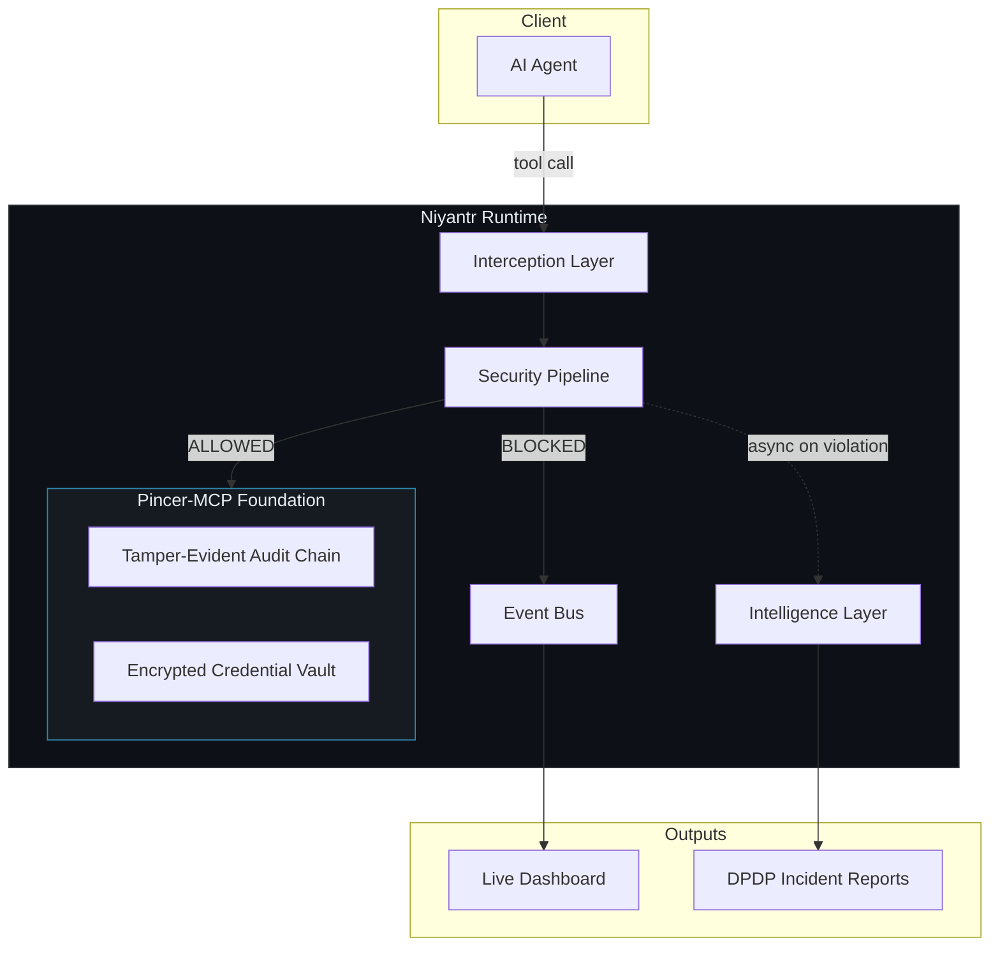

<div align="center">


# नियंत्र · Niyantr

### AI Agent Security & DPDP Compliance Runtime for India Stack

[](LICENSE)
[](docs/DPDP_COMPLIANCE.md)
[](https://modelcontextprotocol.io)
[](https://github.com/VouchlyAI/Pincer-MCP)

**Niyantr** intercepts every action an AI agent attempts to take and enforces formally-specified behavioural contracts in real time — before execution. Violations are blocked, analyzed, and reported as DPDP Act–compliant incidents automatically.

[How It Works](#how-it-works) · [DPDP Compliance](docs/DPDP_COMPLIANCE.md) · [Architecture](docs/ARCHITECTURE.md)

</div>

---

## The Problem

AI agents deployed in citizen-facing services don't just generate text — they *act*. They query databases, call APIs, process payments, and access sensitive citizen records. A single prompt injection attack against a government AI agent can expose Aadhaar numbers, UPI IDs, and financial records protected under the **DPDP Act, 2023** — triggering penalties up to ₹250 crore.

Existing security tools operate at the **text layer**. They analyse what an agent *says*. Niyantr operates at the **action layer** — enforcing what an agent is *allowed to do*.

---

## What Niyantr Does

```
Without Niyantr                         With Niyantr

AI Agent ──→ accesses salary_data       AI Agent ──→ accesses salary_data
                 ↓                                       ↓
             Data exfiltrated                   ┌── Niyantr ──────────┐
                                                │   BLOCKED            │
                                                └─────────────────────┘
                                                           ↓
                                                  DPDP Incident Report
```

Every agent tool call is intercepted, validated against a formal behavioural contract, and either permitted or blocked — before it reaches any downstream system. Blocked violations are automatically analyzed and written to a tamper-evident audit trail.

---

## Architecture



| Component | Role |
|-----------|------|
| **Interception Layer** | Receives all agent tool calls before execution |
| **Security Pipeline** | Multi-stage enforcement — PII detection, contract validation, intent analysis |
| **Intelligence Layer** | Post-violation AI reasoning — classifies attacks, generates DPDP reports |
| **Event Bus** | Real-time stream to the live dashboard |
| **Audit Chain** | SHA-256 tamper-evident log of every action |
| **Credential Vault** | AES-256-GCM encrypted store with OS Keychain master key (Pincer-MCP) |

---

## How It Works

### Behavioural Contracts

Every AI agent is governed by a formally-specified behavioural contract defining its authorised scope — which tools it may call, which data it may not access, how personal data must be handled, and rate constraints. Contracts are validated and enforced at runtime.

### The Enforcement Guarantee

When an agent makes a tool call, Niyantr intercepts it. If the call falls outside the agent's contract — wrong tool, forbidden data, policy-violating PII, suspicious pattern — it is blocked synchronously before any downstream system is touched. The agent receives a denial. The incident is logged.

### AI-Assisted Compliance Reporting

Blocked violations trigger an asynchronous intelligence pipeline that classifies the attack, maps it to applicable DPDP Act provisions, and produces a structured incident report with remediation guidance — without adding latency to the enforcement path.

### Indian PII Recognition

Niyantr includes purpose-built recognizers for Indian identity and financial document formats — accurately detecting Aadhaar numbers, UPI handles, PAN cards, and mobile numbers while avoiding common false positive patterns that affect generic scanners.

---

## Demo: Doot Agent Under Attack

Niyantr is demonstrated against **Mock Doot** — a simulated MCD (Municipal Corporation Delhi) citizen AI service handling grievances, property tax, and identity verification.

An adversary embeds system-level instructions inside a grievance form field, attempting to redirect the agent into accessing records outside its authorised scope.

**Without Niyantr:** The attack succeeds.  
**With Niyantr:** Blocked before execution. Dashboard alerts. DPDP incident report generated.

---

## DPDP Act 2023 Compliance

| Provision | Obligation | Coverage |
|-----------|-----------|----------|
| §4(1) | Process only for consented lawful purpose | Purpose enforcement per session |
| §6(1) | Consent limited to necessary data | Per-agent scope enforcement |
| §8(5) | Reasonable security safeguards — **₹250 Crore** | Blocking before execution |
| §8(6) | Breach notification readiness — **₹200 Crore** | Audit chain + incident reports |
| §9 | Children's data protection — **₹200 Crore** | Configurable elevated policies |
| §11(1) | Right to access processing information | Full provenance in audit chain |

→ [DPDP_COMPLIANCE.md](docs/DPDP_COMPLIANCE.md) — full compliance framework with statutory references.

---

## Foundation: Pincer-MCP

Niyantr extends [Pincer-MCP](https://github.com/VouchlyAI/Pincer-MCP) — a production MCP security gateway. Pincer's credential vault, proxy token isolation, JIT decryption, memory scrubbing, and SHA-256 audit chain are used unmodified as the security foundation. Niyantr's enforcement and intelligence layers are additive extensions.

---

## Repository

This repository contains project documentation. Source code is not publicly available.

```
Niyantr/
└── docs/
    ├── ARCHITECTURE.md      # System design overview
    └── DPDP_COMPLIANCE.md   # DPDP Act 2023 compliance framework
```

---

## License

Apache 2.0 — See [LICENSE](LICENSE).  
Pincer-MCP foundation is © VouchlyAI, Apache 2.0.

---

<div align="center">

**Built for India Innovates 2026**  
*Securing the agentic layer of India Stack*

</div>