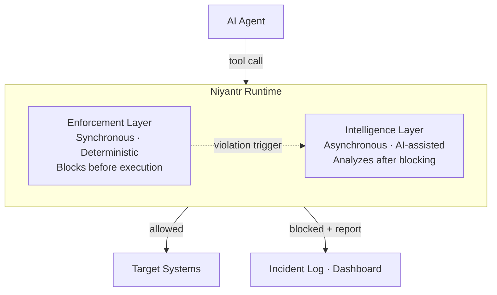
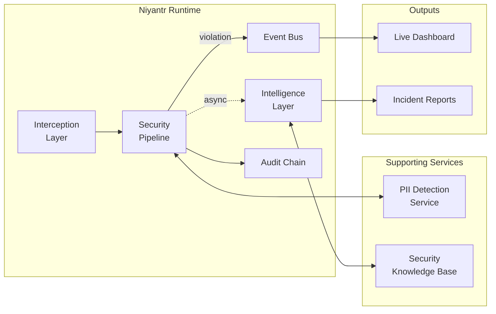
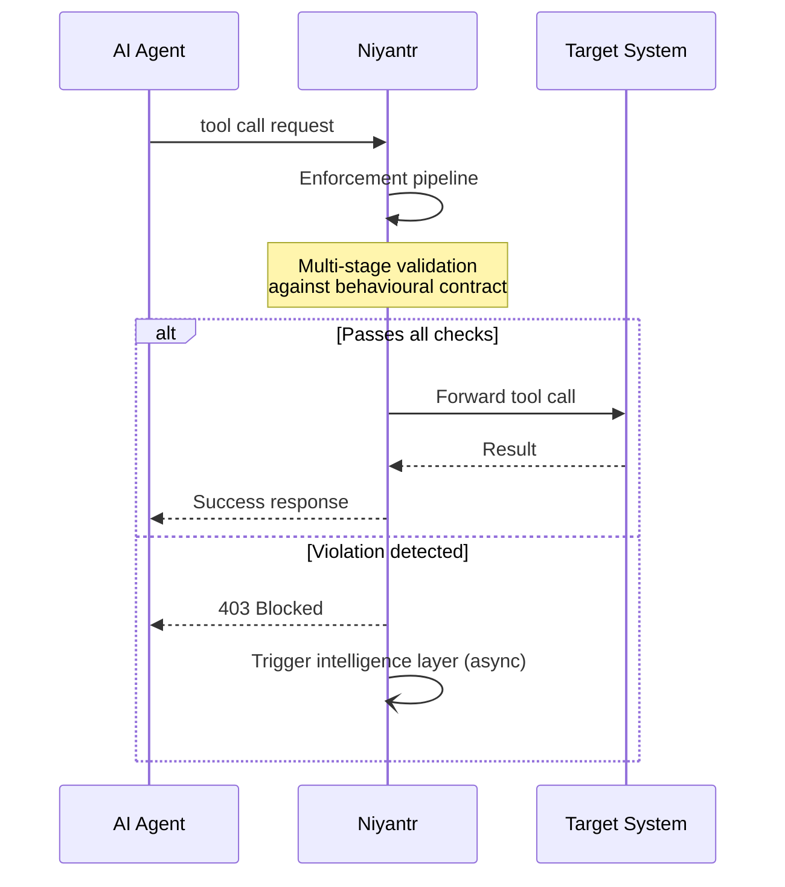

# Niyantr — Architecture Overview

> **Note:** This document provides a high-level overview of Niyantr's architecture for evaluation purposes. Implementation details, internal pipeline design, and proprietary components are intentionally not described. Source code is not publicly available.

---

## System Design

Niyantr operates as a **transparent security proxy** — positioned between an AI agent and every system it interacts with. No tool call reaches a downstream system without passing through Niyantr first.

The runtime has two layers with distinct responsibilities:

**Enforcement Layer** — deterministic, runs in the critical path of every tool call. No AI model is involved. A decision is made and returned to the agent before any downstream system is contacted.

**Intelligence Layer** — AI-assisted, runs asynchronously after a violation is blocked. Enriches the incident record without adding latency to enforcement.

---

## Components

| Component | Responsibility |
|-----------|---------------|
| **Interception Layer** | Entry point — receives all agent tool calls over HTTP |
| **Security Pipeline** | Multi-stage enforcement against behavioural contracts |
| **PII Detection Service** | Identifies Indian personal data entities in tool arguments |
| **Intelligence Layer** | Reasons over violations, classifies attacks, generates DPDP reports |
| **Security Knowledge Base** | Retrieval-augmented context for violation analysis |
| **Event Bus** | Real-time event stream to the dashboard |
| **Audit Chain** | Tamper-evident, append-only record of every tool call |
| **Live Dashboard** | Operational visibility — tool calls, violations, DPDP status |

---

## Behavioural Contracts

The contract is the central security primitive. Every agent deployment is governed by a formally-specified YAML document that declares its authorised scope. The contract is the answer to: *what is this agent permitted to do?*

A contract specifies:
- Which tools the agent may call (explicit allowlist — anything else is blocked)
- Which data stores it may never access (blocklist applied to all tool arguments)
- How each category of personal data must be handled (`BLOCK`, `LOG_AND_ALLOW`)
- Rate constraints on tool call frequency
- The declared purpose of the session
- DPDP Act provisions applicable to this agent's data scope

Contracts are validated before loading. Any validation failure results in a maximally restrictive fallback — the agent is blocked from all tool calls until a valid contract is provided.

---

## Enforcement Flow

The enforcement decision is made **before** the tool call reaches any target system. The agent is denied access synchronously. There is no race condition — the block is not a warning or a log entry, it is a hard gate.

---

## Intelligence Layer

The intelligence layer is not in the enforcement path. It activates after a violation has already been blocked, and its purpose is to enrich the incident record.

Given a blocked violation, the intelligence layer:
1. Retrieves relevant context from the security knowledge base
2. Reasons over the violation to classify the attack and assess its intent
3. Maps the violation to applicable DPDP Act provisions
4. Produces a structured incident report with remediation guidance
5. Emits a real-time analysis event to the dashboard

The output is an incident report that is useful for regulatory disclosure, internal review, and remediation — ready without any manual effort from the operator.

---

## Indian PII Recognition

A dedicated service handles recognition of Indian-specific personal data entities. Standard PII scanners are designed for Western document formats and miss or misclassify Indian identity documents. Niyantr's recognition service is purpose-built for the India Stack data landscape.

Detected entities are mapped directly to DPDP Act provisions and penalty exposure, enabling accurate incident classification and reporting.

---

## Audit & Compliance

Every tool call — permitted or blocked — produces an audit entry. The audit chain is append-only with cryptographic linking between entries, providing tamper evidence for regulatory and forensic purposes.

Blocked violations produce DPDP incident reports that include:
- Attack classification
- Data categories at risk
- Applicable DPDP Act sections and maximum penalty exposure
- Remediation steps

A blocked attack does not constitute a personal data breach under the DPDP Act (no data was accessed). The incident report documents this explicitly, supporting breach notification obligations under §8(6) if required.

---

## Foundation: Pincer-MCP

Niyantr extends [Pincer-MCP](https://github.com/VouchlyAI/Pincer-MCP) as its security foundation. The following Pincer-MCP capabilities are used unmodified:

- **Two-tier credential vault** — OS Keychain master key + AES-256-GCM encrypted store
- **Proxy token isolation** — agents never handle real credentials
- **JIT decryption + memory scrubbing** — secrets zeroed after each use
- **SHA-256 tamper-evident audit chain** — append-only with chain hashing

Niyantr's enforcement and intelligence layers are additive extensions to this foundation.

---

> *Some aspects of Niyantr's design — including the enforcement pipeline internals, the intelligence layer architecture, the knowledge base construction, and the PII recognition approach — are proprietary and not described in this document. This overview is intended to convey the system's security model and compliance posture without exposing implementation details.*

---

*Niyantr Architecture Overview — VouchlyAI — India Innovates 2026*