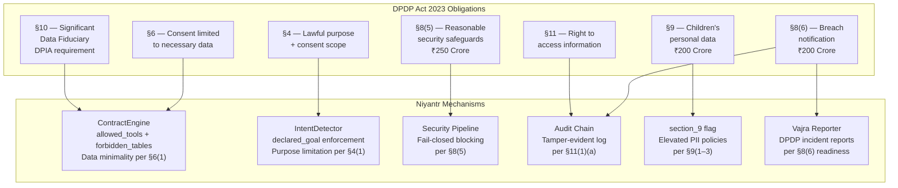

# DPDP Act 2023 — Compliance Framework for Niyantr

> **Disclaimer:** This document is for informational purposes and does not constitute legal advice. All statutory text is reproduced from the official gazette publication of the Digital Personal Data Protection Act, 2023 (No. 22 of 2023) and the Digital Personal Data Protection Rules, 2025, as published by the Government of India. Consult qualified legal counsel for specific compliance obligations.
>
> **Legislative status:** As of the time of writing, the DPDP Act, 2023 has received Presidential assent but its operational provisions are yet to be fully notified into force. The DPDP Rules, 2025 were published in the Official Gazette on 6 January 2025 with staggered commencement dates.[^1] Organisations are advised to prepare for compliance regardless.

---

## Table of Contents

1. [Background](#1-background)
2. [Why AI Agents Create New DPDP Exposure](#2-why-ai-agents-create-new-dpdp-exposure)
3. [Penalty Framework (The Schedule)](#3-penalty-framework-the-schedule)
4. [Section 4 — Grounds for Processing](#4-section-4--grounds-for-processing-personal-data)
5. [Section 6 — Consent](#5-section-6--consent)
6. [Section 8 — General Obligations of Data Fiduciary](#6-section-8--general-obligations-of-data-fiduciary)
7. [Section 9 — Processing Personal Data of Children](#7-section-9--processing-personal-data-of-children)
8. [Section 10 — Significant Data Fiduciary Obligations](#8-section-10--significant-data-fiduciary)
9. [Section 11 — Right to Access Information](#9-section-11--right-to-access-information)
10. [Niyantr Compliance Mapping](#10-niyantr-compliance-mapping)
11. [Incident Report Format](#11-incident-report-format)
12. [Data Minimisation in Logging](#12-data-minimisation-in-logging)
13. [Contract Configuration Reference](#13-contract-configuration-reference)
14. [References](#14-references)

---

## 1. Background

The **Digital Personal Data Protection Act, 2023** (No. 22 of 2023)[^2] received Presidential assent on 11 August 2023. It is India's first standalone personal data protection legislation, superseding the data protection provisions of the Information Technology (Reasonable Security Practices and Procedures and Sensitive Personal Data or Information) Rules, 2011[^3] made under Section 43A of the Information Technology Act, 2000.

The Act's long title states its purpose:

> *"An Act to provide for the processing of digital personal data in a manner that recognises both the right of individuals to protect their personal data and the need to process such personal data for lawful purposes and for matters connected therewith or incidental thereto."*[^2]

The Act regulates **digital personal data** — any data about an individual who is identifiable by or in relation to such data, in digital form.[^2] It applies to the processing of digital personal data within India, and to processing outside India where it is in connection with offering goods or services to Data Principals located in India.[^2]

Key defined terms relevant to Niyantr:

| Term | Meaning under the Act |
|------|----------------------|
| **Data Principal** | The individual to whom personal data relates[^2] |
| **Data Fiduciary** | Any person who alone or with others determines the purpose and means of processing[^2] |
| **Data Processor** | Any person who processes personal data on behalf of a Data Fiduciary[^2] |
| **Personal data breach** | Unauthorised processing, accidental disclosure, acquisition, sharing, use, alteration, destruction or loss of access to personal data[^2] |

---

## 2. Why AI Agents Create New DPDP Exposure

The DPDP Act was designed with traditional data systems in mind. AI agents introduce a threat surface the Act did not explicitly anticipate: an autonomous system that can be manipulated through natural language to act outside the scope for which the Data Principal gave consent.

Consider a citizen AI agent deployed to handle grievance submissions. The Data Principal consented to their personal data being processed **for filing a grievance**. A prompt injection attack that causes that same agent to query salary records or Aadhaar databases is processing outside the scope of the original consent — and potentially a personal data breach — without any human operator having intended it.

The critical point is that **intent is irrelevant to liability** under the Act. Section 8(1) makes the Data Fiduciary responsible for complying with the Act *"irrespective of any agreement to the contrary."*[^2] If a breach occurs on a Data Fiduciary's infrastructure using their AI agent, the obligation falls on them regardless of how the breach was caused.

Niyantr's position is therefore: DPDP compliance for agentic AI deployments requires enforcement at the **tool-call layer** — blocking unauthorised actions before they execute — not just at the data storage layer after the fact.

---

## 3. Penalty Framework (The Schedule)

Penalties are imposed by the Data Protection Board of India[^6] under Section 33 and quantified in the Schedule to the Act.[^2] Importantly, **penalties under the DPDP Act are violation-type based, not data-category based.** Unlike the GDPR, the Act does not create heightened tiers for biometric, health or financial data. The penalty tier is determined by which obligation was breached.

| Sl. No. | Breach | Maximum Penalty |
|---------|--------|----------------|
| 1 | Failure to take reasonable security safeguards to prevent a personal data breach — **§8(5)** | ₹250 Crore |
| 2 | Failure to give the Board or affected Data Principals notice of a personal data breach — **§8(6)** | ₹200 Crore |
| 3 | Breach of obligations in relation to children's personal data — **§9** | ₹200 Crore |
| 4 | Breach of additional obligations of a Significant Data Fiduciary — **§10** | ₹150 Crore |
| 5 | Breach of duties by Data Principal — **§15** | ₹10,000 |
| 6 | Breach of any term of voluntary undertaking accepted by the Board — **§32** | Up to the extent applicable |
| 7 | Breach of any other provision of this Act or the rules made thereunder | ₹50 Crore |

*Source: The Schedule [See §33(1)], Digital Personal Data Protection Act, 2023.[^2]*

> **Key implication for AI agent deployments:** The largest penalty exposure — ₹250 crore — is for failure to implement reasonable security safeguards under §8(5). A successful prompt injection attack against an AI agent that results in unauthorised access to personal data is precisely the kind of breach this provision addresses.

---

## 4. Section 4 — Grounds for Processing Personal Data

### Statutory text

> **4.(1)** A person may process the personal data of a Data Principal only in accordance with the provisions of this Act and for a lawful purpose —
> - **(a)** for which the Data Principal has given her consent; or
> - **(b)** for certain legitimate uses.
>
> **4.(2)** For the purposes of this section, the expression "lawful purpose" means any purpose which is not expressly forbidden by law.[^2]

Legitimate uses without explicit consent are enumerated exhaustively in Section 7 and include: voluntary provision of data for a specified purpose, State functions, performance of legal obligations, medical emergencies, disaster response, and employment-related purposes.[^2] There is no open-ended "legitimate interests" ground, unlike the GDPR.[^8]

### Relevance to AI agents

Section 4 establishes the foundational principle: processing is only permitted for the purpose for which consent was obtained, or a legitimate use under Section 7. An AI agent deployed to handle grievance submissions that is manipulated into accessing salary records is processing personal data for a purpose outside the Data Principal's consent — making it unauthorised under §4(1)(a).

The agent operator's lack of intent does not change this analysis. The processing happened; it was outside the consented purpose.

### How Niyantr addresses this

Every session requires a `declared_goal` — the stated lawful purpose for that session. The Intent Detector cross-references every tool call against the declared purpose. Tool calls inconsistent with the declared purpose are blocked before any data is accessed. Every permitted data access is written to the tamper-evident audit chain with full purpose attribution.

---

## 5. Section 6 — Consent

### Statutory text (selected sub-sections)

> **6.(1)** The consent given by the Data Principal shall be free, specific, informed, unconditional and unambiguous with a clear affirmative action, and shall signify an agreement to the processing of her personal data for the specified purpose and **be limited to such personal data as is necessary for such specified purpose.**[^2]

The Act provides an illustration directly relevant to the AI agent context:

> *Illustration: "X, an individual, downloads Y, a telemedicine app. Y requests the consent of X for (i) the processing of her personal data for making available telemedicine services, and (ii) accessing her mobile phone contact list, and X signifies her consent to both. **Since phone contact list is not necessary for making available telemedicine services, her consent shall be limited to the processing of her personal data for making available telemedicine services.**"*[^2]

> **6.(4)** Where consent given by the Data Principal is the basis of processing of personal data, such Data Principal shall have the right to withdraw her consent at any time, with the ease of doing so being comparable to the ease with which such consent was given.[^2]

### Relevance to AI agents

Section 6(1)'s requirement that consent be *"limited to such personal data as is necessary for such specified purpose"* operationally means an agent that has consent for grievance processing has consent only for data necessary for that function — not all data it can technically reach. Behavioural contracts implement this principle at the enforcement layer.

### How Niyantr addresses this

The `allowed_tools` allowlist and `forbidden_tables` blocklist together ensure an agent can only access what the declared consent covers. Any attempt to access data beyond declared scope is blocked, logged, and flagged as a potential consent scope violation.

---

## 6. Section 8 — General Obligations of Data Fiduciary

This is the most directly relevant section for organisations deploying AI agents. It contains both the **security safeguards obligation** (attracting the highest penalty) and the **breach notification obligation**.

### Statutory text

> **8.(1)** A Data Fiduciary shall, **irrespective of any agreement to the contrary** or failure of a Data Principal to carry out the duties provided under this Act, be responsible for complying with the provisions of this Act and the rules made thereunder in respect of any processing undertaken by it **or on its behalf by a Data Processor.**[^2]

> **8.(4)** A Data Fiduciary shall implement **appropriate technical and organisational measures** to ensure effective observance of the provisions of this Act and the rules made thereunder.[^2]

> **8.(5)** A Data Fiduciary shall protect personal data in its possession or under its control, including in respect of any processing undertaken by it or on its behalf by a Data Processor, by taking **reasonable security safeguards to prevent personal data breach.**[^2]

> **8.(6)** In the event of a personal data breach, the Data Fiduciary shall give the Board and each affected Data Principal, **intimation of such breach** in such form and manner as may be prescribed.[^2]

> **8.(7)** A Data Fiduciary shall, unless retention is necessary for compliance with any law for the time being in force —
> - **(a)** erase personal data, upon the Data Principal withdrawing her consent or as soon as it is reasonable to assume that the specified purpose is no longer being served, whichever is earlier; and
> - **(b)** cause its Data Processor to erase any personal data that was made available by the Data Fiduciary for processing to such Data Processor.[^2]

### Relevance to AI agents

**§8(1)** is foundational: a Data Fiduciary is fully responsible for processing undertaken on its behalf by a Data Processor. An AI agent is a Data Processor acting on the Data Fiduciary's behalf. This means the deploying organisation bears complete liability for what the agent does — including actions the agent was manipulated into taking through prompt injection.

**§8(4)** requires "appropriate technical and organisational measures." For an AI agent deployment, this must include controls that prevent the agent from being weaponised against the very data access boundaries the deploying organisation is responsible for. A deployment with no tool-call enforcement layer cannot credibly be characterised as having appropriate technical measures.

**§8(5)** requires "reasonable security safeguards to prevent personal data breach." A successful prompt injection that results in unauthorised data access is a personal data breach under the Act's definition. Absence of any enforcement layer would be difficult to defend as reasonable.

**§8(6) + Schedule Item 2** — breach notification to the Board and affected Data Principals carries up to ₹200 crore. A successfully blocked attack does not constitute a personal data breach — no data was accessed. Niyantr's incident reports explicitly record this.

### How Niyantr addresses this

| Section 8 Obligation | Niyantr Mechanism |
|----------------------|-------------------|
| **§8(1)** Responsible for Data Processor actions | ContractEngine governs all agent tool calls regardless of trigger |
| **§8(4)** Appropriate technical and organisational measures | Documented behavioural contracts + pipeline enforcement |
| **§8(5)** Security safeguards against breach | Fail-closed pipeline; always-forbidden table baseline; sub-5ms in-process blocking |
| **§8(6)** Breach notification readiness | Tamper-evident audit chain; Vajra DPDP incident reports |
| **§8(7)** Erase data when purpose no longer served | Session state cleared on session end; no citizen data retained in runtime |

---

## 7. Section 9 — Processing Personal Data of Children

### Statutory text

> **9.(1)** The Data Fiduciary shall, before processing any personal data of a child or a person with disability who has a lawful guardian, **obtain verifiable consent of the parent** of such child or the lawful guardian, as the case may be, in such manner as may be prescribed.[^2]
>
> **9.(2)** A Data Fiduciary shall **not undertake such processing of personal data that is likely to cause any detrimental effect on the well-being of a child.**[^2]
>
> **9.(3)** A Data Fiduciary shall **not undertake tracking or behavioural monitoring of children or targeted advertising directed at children.**[^2]

*A child is defined as a person below the age of 18 years.[^2]*

### DPDP Rules, 2025 — Rule 10 (Verifiable Consent for Children)

> **Rule 10(1):** A Data Fiduciary shall adopt appropriate technical and organisational measures to ensure that verifiable consent of the parent is obtained before the processing of any personal data of a child and shall observe due diligence, for checking that the individual identifying herself as the parent is an adult who is identifiable... by reference to —
> - **(a)** reliable details of identity and age of the individual available with the Data Fiduciary; or
> - **(b)** the identity of such individual as a registered user on the platform of a Digital Locker service provider or an entity entrusted with maintaining data by the Central Government...[^1]

### Penalty

Breach of Section 9 obligations: up to **₹200 crore** (Schedule Item 3).[^2]

### Relevance to AI agents

Government AI agents may encounter data subjects who are minors in guardianship-based grievance filings, property records, or identity verification flows. Without active enforcement there is no technical mechanism preventing processing of a child's data without the required verifiable parental consent.

### How Niyantr addresses this

Contracts include a `dpdp_flags.section_9` boolean. When `true`, the contract validator automatically elevates PII handling policies for contact identifiers to `BLOCK` — preventing those identifiers from being processed without an explicit consent verification step at the application layer. Section 9 activation is flagged in all DPDP incident reports for the agent.

---

## 8. Section 10 — Significant Data Fiduciary

### Statutory text

> **10.(1)** The Central Government may notify any Data Fiduciary or class of Data Fiduciaries as **Significant Data Fiduciary**, on the basis of an assessment of such relevant factors as it may determine, including —
> - **(a)** the volume and sensitivity of personal data processed;
> - **(b)** risk to the rights of Data Principals;
> - **(c)** potential impact on the sovereignty and integrity of India;
> - **(d)** risk to electoral democracy;
> - **(e)** security of the State; and
> - **(f)** public order.[^2]
>
> **10.(2)** The Significant Data Fiduciary shall —
> - **(a)** appoint a Data Protection Officer based in India;
> - **(b)** appoint an independent data auditor; and
> - **(c)** undertake periodic **Data Protection Impact Assessments (DPIA)**, periodic audit, and such other measures as may be prescribed.[^2]

### Penalty

Breach of Significant Data Fiduciary obligations: up to **₹150 crore** (Schedule Item 4).[^2]

### Relevance to AI agents

Government bodies processing citizen data at scale are likely candidates for Significant Data Fiduciary designation given the factors in §10(1). For such entities, Niyantr's behavioural contracts provide direct input into the DPIA process under §10(2)(c): each contract documents the risk assessment and access scope per agent; the audit log documents what was actually processed.

---

## 9. Section 11 — Right to Access Information

### Statutory text

> **11.(1)** The Data Principal shall have the right to obtain from the Data Fiduciary... upon making to it a request —
> - **(a)** a summary of personal data which is being processed by such Data Fiduciary and **the processing activities undertaken** by that Data Fiduciary with respect to such personal data;
> - **(b)** the **identities of all other Data Fiduciaries and Data Processors** with whom the personal data has been shared by such Data Fiduciary, along with a description of the personal data so shared; and
> - **(c)** any other information related to the personal data of such Data Principal and its processing, as may be prescribed.[^2]

### Relevance to AI agents

An organisation cannot respond accurately to a §11 request if it cannot account for what its AI agents have done with a citizen's data. Agents operating without audit trails or formally declared scope make fulfilment of §11(1)(a) practically impossible.

### How Niyantr addresses this

Every agent's authorised processing scope is declared in a versioned behavioural contract. Every tool call — permitted or blocked — is written to the SHA-256 tamper-evident audit chain with agent identity, session ID, declared purpose, and outcome. The `GET /agents/:agentId/contract` endpoint exposes the current contract. Together, these provide a complete record to respond to §11(1)(a) requests.

---

## 10. Niyantr Compliance Mapping



### Full coverage table

| Provision | Obligation | Niyantr Mechanism |
|-----------|-----------|-------------------|
| **§4(1)** | Process only for consented lawful purpose | `declared_goal` + IntentDetector blocks out-of-purpose calls |
| **§6(1)** | Consent limited to necessary data | `allowed_tools` allowlist + `forbidden_tables` blocklist |
| **§8(1)** | Responsible for Data Processor actions | ContractEngine governs all agent actions regardless of trigger |
| **§8(4)** | Appropriate technical and organisational measures | Documented contract enforcement pipeline |
| **§8(5)** | Security safeguards against breach | Fail-closed blocking; always-forbidden baseline; sub-5ms enforcement |
| **§8(6)** | Breach notification readiness | Full audit chain + DPDP incident reports per violation |
| **§8(7)** | Erase data when purpose no longer served | Session state cleared on end; no citizen data retained in runtime |
| **§9(1–3)** | Children's data protections | `section_9` flag auto-elevates PII policies |
| **§10(2)(c)** | DPIA (Significant Data Fiduciary) | Contracts serve as per-agent risk documentation |
| **§11(1)** | Right to access processing information | Audit chain + `GET /agents/:agentId/contract` endpoint |

---

## 11. Incident Report Format

Every violation analysed by Vajra produces a structured Markdown report in `dpdp-reports/` and an entry in `incident_log.json`. A successfully blocked attack does not constitute a personal data breach under the Act (no unauthorised access occurred), but the report provides the complete record necessary for §8(6) notification if a breach does occur.

```
# NIYANTR — DPDP INCIDENT REPORT

Incident ID    : viol_xK9mT2pQnR
Timestamp      : 2026-03-28T14:32:11.000Z (UTC)
Status         : BLOCKED — no personal data was accessed or exfiltrated
Agent ID       : mcd-grievance-agent
Session ID     : sess_attack_demo_1
Tool Attempted : submit_grievance
Pipeline ms    : 43

─────────────────────────────────────────────────────────────────
ATTACK CLASSIFICATION
─────────────────────────────────────────────────────────────────
Direct Prompt Injection via Form Field
OWASP LLM Top 10 (2025): LLM01 — Prompt Injection

─────────────────────────────────────────────────────────────────
INCIDENT NARRATIVE  [Vajra-generated — no citizen PII reproduced]
─────────────────────────────────────────────────────────────────

─────────────────────────────────────────────────────────────────
DPDP ACT 2023 RELEVANCE
─────────────────────────────────────────────────────────────────
Had this attack succeeded:
  §8(5) — Failure to maintain reasonable security safeguards
           Maximum penalty: ₹250 Crore [Schedule Item 1]
  §8(6) — Breach notification obligation would have arisen
           Maximum penalty: ₹200 Crore [Schedule Item 2]

Outcome: Security safeguards functioned as intended. No breach occurred.

─────────────────────────────────────────────────────────────────
AUDIT CHAIN REFERENCE
─────────────────────────────────────────────────────────────────
Chain hash : a1b2c3d4e5f6...
Prev hash  : 9f8e7d6c5b4a...
Verify at  : ~/.pincer/audit.jsonl

─────────────────────────────────────────────────────────────────
Generated by Niyantr Security Runtime — VouchlyAI
This report does not constitute legal advice.
```

---

## 12. Data Minimisation in Logging

Consistent with the Act's purpose limitation principle (§4) and the consent scope requirement (§6(1)), Niyantr applies strict data minimisation to its own operational logging:

- **PII values are never written to any log.** When Presidio detects an Aadhaar number in tool call arguments, the audit entry records `entity_type: AADHAAR_NUMBER` and a confidence score. The actual number is not written anywhere.
- **`blocked_value` in violation events** records only the entity type or table name that triggered the block — never the argument content.
- **Vajra incident reports** describe attacks in terms of data categories and access risk. Citizens' personal data is never reproduced in any report.
- **Session state** (declared goal, tool history, call count) is cleared when a session ends. No citizen data is persisted beyond the session in Niyantr's runtime.

---

## 13. Contract Configuration Reference

### PII policy values

| Value | Pipeline behaviour | Recommended use |
|-------|-------------------|-----------------|
| `BLOCK` | Tool call blocked if this entity type is detected in arguments | High-risk identifiers; agents without explicit processing purpose for this data |
| `LOG_AND_ALLOW` | Tool call proceeds; detection logged to audit chain | Minimum recommended for any personal data; provides audit trail |
| `ALLOW` | Auto-upgraded to `LOG_AND_ALLOW` at contract validation | Not available as a configurable option — removed to prevent misconfiguration |

### Minimum DPDP-compliant contract

```yaml
agent: your-agent-name

# Explicit allowlist only — §6(1) data minimality
allowed_tools:
  - tool_a
  - tool_b

# All tables not required for declared function — §8(5) safeguards
forbidden_tables:
  - admin_logs
  - salary_data
  - aadhaar_master
  - personnel
  - audit_trail
  - user_credentials

max_records_per_session: 10

# PII handling — §8(5) security safeguard obligation
pii_policy:
  AADHAAR_NUMBER: LOG_AND_ALLOW
  UPI_ID: BLOCK
  PAN_NUMBER: LOG_AND_ALLOW
  PHONE_NUMBER: LOG_AND_ALLOW
  EMAIL_ADDRESS: LOG_AND_ALLOW

rate_limits:
  api_calls_per_minute: 30

# Purpose enforcement — §4(1) and §6(1)
intent_constraints:
  session_goal_required: true
  deviation_threshold: 0.7

# Controls penalty exposure mapping in incident reports
dpdp_flags:
  section_8: true   # Agent processes personal data
  section_9: false  # Set true if agent may encounter data of persons under 18
```

When `section_9: true`, the validator automatically elevates `PHONE_NUMBER` and `EMAIL_ADDRESS` policies to `BLOCK` per §9(1) obligations. This cannot be reversed once Section 9 is flagged.

---

## 14. References

[^1]: Digital Personal Data Protection Rules, 2025. Ministry of Electronics and Information Technology, Government of India. Published in the Official Gazette, 6 January 2025. Available at: https://dpdpa.com/DPDP_Rules_2025_English_only.pdf

[^2]: Digital Personal Data Protection Act, 2023 (No. 22 of 2023). Ministry of Law and Justice, Government of India. Presidential assent: 11 August 2023. Official text via India Code: https://www.indiacode.nic.in/handle/123456789/22037 | Chapter-by-chapter text: https://www.dpdpact2023.com/

[^3]: Information Technology (Reasonable Security Practices and Procedures and Sensitive Personal Data or Information) Rules, 2011. Ministry of Communications and Information Technology, Government of India.

[^4]: Justice K.S. Puttaswamy (Retd.) v. Union of India, (2017) 10 SCC 1. Supreme Court of India. Established right to privacy as a fundamental right under Article 21 of the Constitution of India.

[^5]: OWASP Top 10 for Large Language Model Applications, 2025. LLM01: Prompt Injection. https://owasp.org/www-project-top-10-for-large-language-model-applications/

[^6]: Data Protection Board of India — adjudicatory body established under §18 of the DPDP Act, 2023.

[^7]: DLA Piper — Data Protection Laws of the World: India. https://www.dlapiperdataprotection.com/?t=law&c=IN

[^8]: PRS Legislative Research — Digital Personal Data Protection Bill, 2023. Legislative analysis and background. https://prsindia.org/billtrack/digital-personal-data-protection-bill-2023

---

*Niyantr DPDP Compliance Framework — VouchlyAI — India Innovates 2026*  
*This document does not constitute legal advice.*